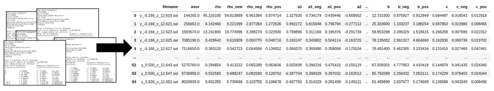

# Introduction

A collection of tools and scripts which are useful for maipulating XRD data and performing CMWP

# Contents

### Scripts
- **src/xrd_tools.py** (library containing useful general XRD routines)
  - getReflections: makes a list of peak hkl and position for given wavelength and crystal structure
- **src/cmwp_tools.py** (library contining useful commands specific to CMWP)
  - load_tifs: Load images from files using fabio
  - integrate_join:  Integrate images from two detectors using pyFAI and join together
  - calculateLatticeParams:  Uses minimisation of an objective function based on the Hull-Davey formula to calculate lattice paramaters
  - dislocationTypeCalc:  Calculation of dislocation type from given `a1` and `a2` values for a hcp crystal
  - extractDataDir:  Extract physical paramaters from all CMWP solution files in a directory
  - getBaseline: Produces a background spline for given 2theta positions
  - getPeaks: Finds peak positions and intensity in a pattern, given approximate 2theta positions
   
### Datafiles
- **data/srim.txt** (SRIM data for 2 MeV proton irradiation of Zr - 1dpa at 60% depth)
- **data/ellipticities.txt** (Chk0al, alaL and a2aL for given ellipticity - used for dislocation loop type calculation)
- **data/test.xy** (Test XRD xy data)

### Example Notebooks
- **Extract_data.ipynb** (Data extraction from a folder of .sol files and calculation of a/c loop fraction)
- **Extract_data-new.ipynb** (Data extraction from a folder of .sol files for Wilkens function method)

- **Zr_DESY_2021.ipynb** (Integration of data from DESY experiment and production of .bg-spline.dat and .peak-index.dat)
- **Zr_batch.ipynb** (Production of .bg-spline.dat and .peak-index.dat for pre-integrated data)
- **Label_reflections.ipynb** (Load XRD data and label Zr/ZrH/SPP peaks)
- **Make_CMWP_intrumental.ipynb** - Generates an instrumental folder for CMWP from a LaB6 pattern
